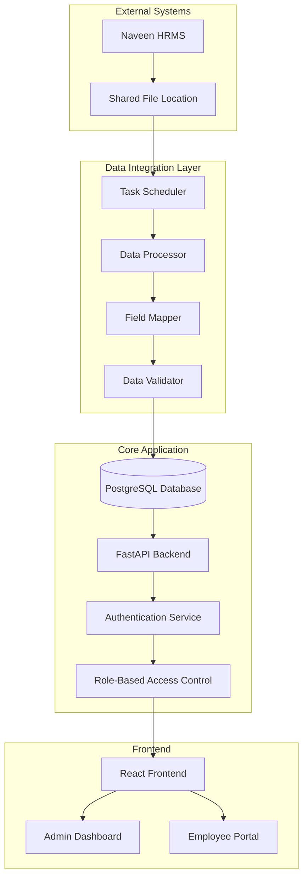
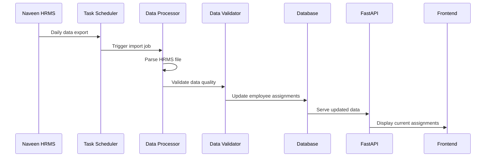

# HRMS Integration & Organizational Structure Design

## Overview

This design extends the existing skill board system to integrate with HRMS data feeds and manage complex organizational structures. The solution adds data synchronization, multi-project assignment management, and enhanced access controls while maintaining the system's core focus on skills and capability development.

The design builds upon the existing FastAPI/SQLAlchemy backend and React frontend, adding new data models, API endpoints, and background processing capabilities for HRMS integration.

## Architecture

### High-Level Architecture



### Data Flow Architecture



## Components and Interfaces

### 1. HRMS Integration Service

**Purpose**: Handles automated data imports from Naveen's HRMS system

**Key Components**:
- `HRMSImportService`: Orchestrates the import process
- `FileWatcher`: Monitors for new HRMS data files
- `DataParser`: Parses various HRMS file formats (CSV, Excel)
- `FieldMapper`: Maps HRMS fields to internal schema
- `ValidationEngine`: Validates data quality and completeness

**Interfaces**:
```python
class HRMSImportService:
    def schedule_import(self, schedule: str) -> bool
    def process_file(self, file_path: str) -> ImportResult
    def validate_import(self, data: List[Dict]) -> ValidationResult
    def map_fields(self, hrms_data: Dict) -> EmployeeData
```

### 2. Multi-Project Assignment Manager

**Purpose**: Manages complex employee project assignments with multiple allocations

**Key Components**:
- `ProjectAssignmentService`: Manages project-employee relationships
- `AllocationValidator`: Ensures allocation percentages are valid
- `ConflictDetector`: Identifies assignment conflicts
- `ManagerAssignmentService`: Handles multiple line manager relationships

**Interfaces**:
```python
class ProjectAssignmentService:
    def assign_employee_to_project(self, employee_id: str, project_id: str, allocation: float, is_primary: bool) -> Assignment
    def update_allocation(self, assignment_id: int, new_allocation: float) -> bool
    def get_employee_assignments(self, employee_id: str) -> List[Assignment]
    def validate_total_allocation(self, employee_id: str) -> ValidationResult
```

### 3. Enhanced Access Control System

**Purpose**: Implements GDPR-compliant role-based access control

**Key Components**:
- `RoleManager`: Manages user roles and permissions
- `AccessLogger`: Logs sensitive data access for audit trails
- `DataClassifier`: Classifies data sensitivity levels
- `PermissionEngine`: Enforces access permissions

**Interfaces**:
```python
class RoleManager:
    def assign_role(self, user_id: int, role: UserRole) -> bool
    def check_permission(self, user_id: int, resource: str, action: str) -> bool
    def get_accessible_employees(self, user_id: int) -> List[Employee]
    def log_access(self, user_id: int, resource: str, action: str) -> None
```

### 4. Level Movement Workflow Engine

**Purpose**: Manages employee level progression and approval workflows

**Key Components**:
- `LevelCriteriaEngine`: Evaluates readiness against criteria
- `WorkflowManager`: Manages approval processes
- `NotificationService`: Sends workflow notifications
- `AuditTracker`: Maintains progression audit trails

**Interfaces**:
```python
class LevelMovementService:
    def evaluate_readiness(self, employee_id: str, target_level: str) -> ReadinessScore
    def initiate_level_request(self, employee_id: str, target_level: str, initiator_id: int) -> WorkflowInstance
    def approve_level_change(self, request_id: int, approver_id: int, decision: bool) -> bool
    def update_employee_level(self, employee_id: str, new_level: str) -> bool
```

## Data Models

### Enhanced Employee Model

```python
class Employee(Base):
    # Existing fields...
    
    # New organizational fields
    line_manager_id = Column(String, nullable=True)  # Primary line manager
    home_capability = Column(String, nullable=True)  # AWL, Technical Delivery, etc.
    grade_level = Column(String, nullable=True)  # A, B, C, L1, L2, etc.
    hire_date = Column(Date, nullable=True)
    location = Column(String, nullable=True)
    cost_center = Column(String, nullable=True)
    
    # Relationships
    project_assignments = relationship("ProjectAssignment", back_populates="employee")
    level_movements = relationship("LevelMovement", back_populates="employee")
```

### Project Assignment Model

```python
class ProjectAssignment(Base):
    __tablename__ = "project_assignments"
    
    id = Column(Integer, primary_key=True)
    employee_id = Column(Integer, ForeignKey("employees.id"), nullable=False)
    project_id = Column(String, nullable=False)  # External project ID from HRMS
    project_name = Column(String, nullable=False)
    allocation_percentage = Column(Float, nullable=False)  # 0.0 to 100.0
    is_primary = Column(Boolean, default=False, nullable=False)
    line_manager_id = Column(String, nullable=True)  # Manager for this project
    start_date = Column(Date, nullable=True)
    end_date = Column(Date, nullable=True)
    status = Column(String, default="Active", nullable=False)  # Active, Completed, Cancelled
    
    # Audit fields
    created_at = Column(DateTime, default=datetime.utcnow)
    updated_at = Column(DateTime, default=datetime.utcnow, onupdate=datetime.utcnow)
    source = Column(String, default="HRMS", nullable=False)  # HRMS, Manual
    
    # Relationships
    employee = relationship("Employee", back_populates="project_assignments")
```

### HRMS Import Log Model

```python
class HRMSImportLog(Base):
    __tablename__ = "hrms_import_logs"
    
    id = Column(Integer, primary_key=True)
    import_date = Column(DateTime, default=datetime.utcnow, nullable=False)
    file_name = Column(String, nullable=False)
    file_size = Column(Integer, nullable=True)
    records_processed = Column(Integer, nullable=False)
    records_created = Column(Integer, nullable=False)
    records_updated = Column(Integer, nullable=False)
    records_failed = Column(Integer, nullable=False)
    status = Column(String, nullable=False)  # Success, Failed, Partial
    error_details = Column(Text, nullable=True)
    processing_time_seconds = Column(Float, nullable=True)
    
    # Validation results
    validation_errors = Column(Text, nullable=True)  # JSON array of validation errors
    data_quality_score = Column(Float, nullable=True)  # 0.0 to 100.0
```

### Level Movement Model

```python
class LevelMovement(Base):
    __tablename__ = "level_movements"
    
    id = Column(Integer, primary_key=True)
    employee_id = Column(Integer, ForeignKey("employees.id"), nullable=False)
    current_level = Column(String, nullable=False)
    target_level = Column(String, nullable=False)
    initiated_by = Column(Integer, ForeignKey("users.id"), nullable=False)
    initiated_at = Column(DateTime, default=datetime.utcnow, nullable=False)
    
    # Readiness assessment
    readiness_score = Column(Float, nullable=True)  # 0.0 to 100.0
    criteria_met = Column(Integer, nullable=False, default=0)
    criteria_total = Column(Integer, nullable=False, default=0)
    
    # Workflow status
    status = Column(String, default="Pending", nullable=False)  # Pending, Approved, Rejected, Cancelled
    current_approver_role = Column(String, nullable=True)  # Manager, CP, HR
    
    # Approval tracking
    manager_approval = Column(Boolean, nullable=True)
    manager_approved_by = Column(Integer, ForeignKey("users.id"), nullable=True)
    manager_approved_at = Column(DateTime, nullable=True)
    
    cp_approval = Column(Boolean, nullable=True)
    cp_approved_by = Column(Integer, ForeignKey("users.id"), nullable=True)
    cp_approved_at = Column(DateTime, nullable=True)
    
    hr_approval = Column(Boolean, nullable=True)
    hr_approved_by = Column(Integer, ForeignKey("users.id"), nullable=True)
    hr_approved_at = Column(DateTime, nullable=True)
    
    # Final decision
    final_decision = Column(Boolean, nullable=True)
    completed_at = Column(DateTime, nullable=True)
    decision_notes = Column(Text, nullable=True)
    
    # Relationships
    employee = relationship("Employee", back_populates="level_movements")
    initiator = relationship("User", foreign_keys=[initiated_by])
```

### Access Log Model

```python
class AccessLog(Base):
    __tablename__ = "access_logs"
    
    id = Column(Integer, primary_key=True)
    user_id = Column(Integer, ForeignKey("users.id"), nullable=False)
    resource_type = Column(String, nullable=False)  # Employee, Assignment, Report
    resource_id = Column(String, nullable=False)
    action = Column(String, nullable=False)  # View, Edit, Delete, Export
    accessed_at = Column(DateTime, default=datetime.utcnow, nullable=False)
    ip_address = Column(String, nullable=True)
    user_agent = Column(String, nullable=True)
    
    # Data sensitivity classification
    data_sensitivity = Column(String, nullable=False)  # Public, Internal, Sensitive, Restricted
    
    # Relationships
    user = relationship("User")
```

## Error Handling

### HRMS Import Error Handling

1. **File Processing Errors**:
   - Invalid file format: Log error, notify admin, skip file
   - Corrupted data: Log specific rows, process valid records
   - Missing required fields: Fail import, provide detailed error report

2. **Data Validation Errors**:
   - Invalid employee IDs: Log for manual review
   - Allocation percentage > 100%: Flag for correction
   - Missing line managers: Use default or previous assignment

3. **System Integration Errors**:
   - Database connection failures: Retry with exponential backoff
   - API timeouts: Queue for retry processing
   - Disk space issues: Alert administrators immediately

### Access Control Error Handling

1. **Authentication Failures**:
   - Invalid credentials: Log attempt, implement rate limiting
   - Expired tokens: Redirect to login with clear message
   - Account lockouts: Notify user and administrators

2. **Authorization Failures**:
   - Insufficient permissions: Log access attempt, show appropriate error
   - Role changes: Refresh user session, update permissions
   - Data access violations: Log for audit, block access immediately

## Testing Strategy

### Unit Testing Approach

The system will use pytest for comprehensive unit testing of individual components:

- **HRMS Import Service**: Test file parsing, field mapping, validation logic
- **Project Assignment Logic**: Test allocation calculations, conflict detection
- **Access Control**: Test permission checking, role assignments
- **Level Movement Workflow**: Test criteria evaluation, approval routing

Unit tests will focus on:
- Individual function behavior with known inputs
- Error handling for invalid data
- Edge cases like boundary conditions
- Integration points between components

### Property-Based Testing Approach

The system will use Hypothesis for property-based testing to verify universal properties across all valid inputs. Property-based tests will run a minimum of 100 iterations each and be tagged with comments referencing the design document properties.

Property-based testing will verify:
- Data consistency across import operations
- Access control enforcement across all user roles
- Allocation percentage calculations across all assignment combinations
- Workflow state transitions across all approval scenarios

Both unit tests and property-based tests are complementary: unit tests catch specific bugs and verify concrete examples, while property tests verify general correctness across the input space. Together they provide comprehensive coverage of the system's behavior.

The property-based testing library for Python will be Hypothesis, which integrates well with pytest and provides excellent support for generating complex test data structures.
## Cor
rectness Properties

*A property is a characteristic or behavior that should hold true across all valid executions of a system-essentially, a formal statement about what the system should do. Properties serve as the bridge between human-readable specifications and machine-verifiable correctness guarantees.*

### Property Reflection

After analyzing all acceptance criteria, several properties can be consolidated to eliminate redundancy:

- Properties related to data import accuracy (1.2, 4.1, 4.2) can be combined into a comprehensive data import consistency property
- Access control properties (5.1, 5.3, 5.4) can be unified into a single access boundary enforcement property  
- Validation properties (1.4, 2.3, 4.4) can be consolidated into a data validation completeness property
- Workflow properties (7.3, 7.4, 7.5) can be combined into a workflow execution correctness property

### Core Correctness Properties

**Property 1: HRMS Data Import Consistency**
*For any* valid HRMS data file, importing then querying the data should return equivalent employee assignments and organizational relationships
**Validates: Requirements 1.2, 4.1, 4.2**

**Property 2: Project Allocation Constraint Enforcement**
*For any* employee with multiple project assignments, the sum of allocation percentages should never exceed 100% and exactly one assignment should be marked as primary
**Validates: Requirements 2.2, 2.3**

**Property 3: Access Control Boundary Enforcement**
*For any* user with a specific role, data access should be restricted to only the resources permitted for that role, and all access attempts should be logged
**Validates: Requirements 5.1, 5.2, 5.3, 5.4**

**Property 4: Data Validation Completeness**
*For any* data import or update operation, all validation rules should be applied and any failures should be logged with complete error details
**Validates: Requirements 1.4, 1.5, 4.4**

**Property 5: Organizational Relationship Preservation**
*For any* employee, their home capability assignment should remain unchanged regardless of project assignment modifications
**Validates: Requirements 2.5**

**Property 6: Assignment Display Completeness**
*For any* employee with project assignments, their profile should display all current assignments with correct allocation percentages and manager relationships
**Validates: Requirements 3.1, 3.3, 3.4**

**Property 7: Conflict Detection Accuracy**
*For any* set of employee assignments containing conflicts or mismatches, the system should detect and highlight all discrepancies correctly
**Validates: Requirements 3.5, 6.2**

**Property 8: Reconciliation Data Comparison**
*For any* reconciliation operation between HRMS and internal data, the comparison should accurately identify matches, differences, and provide correct summary statistics
**Validates: Requirements 6.1, 6.4**

**Property 9: Level Movement Workflow Execution**
*For any* level movement request, the workflow should route through the correct approval sequence, update employee level upon completion, and maintain complete audit trails
**Validates: Requirements 7.3, 7.4, 7.5**

**Property 10: Financial Data Exclusion**
*For any* data query or report generation, financial information (billing, revenue) should be completely excluded while preserving assignment and capability information
**Validates: Requirements 8.1, 8.2, 8.4**

**Property 11: Aggregate Data Anonymization**
*For any* aggregate metrics request, personal identifiers should be removed while maintaining statistical accuracy of capability and skill distributions
**Validates: Requirements 5.5**

**Property 12: Configuration Security Storage**
*For any* HRMS integration configuration, sensitive connection parameters should be encrypted in storage and decrypted correctly upon retrieval
**Validates: Requirements 1.1**

**Property 13: Scheduled Import Execution**
*For any* configured import schedule, the system should execute imports at the specified intervals with correct timing and error handling
**Validates: Requirements 1.3**

**Property 14: Level Criteria Assessment Accuracy**
*For any* employee assessment against level criteria, the progression score should be calculated correctly based on defined skill and experience requirements
**Validates: Requirements 7.1, 7.2**

**Property 15: Investment Project Classification**
*For any* project marked as investment type, it should be flagged appropriately without exposing financial details while maintaining assignment visibility
**Validates: Requirements 6.3**

## Implementation Guidelines

### Database Schema Evolution

The implementation will extend the existing database schema with new tables while maintaining backward compatibility:

1. **Migration Strategy**: Use Alembic migrations to add new tables incrementally
2. **Foreign Key Relationships**: Maintain referential integrity with existing Employee and User tables
3. **Indexing Strategy**: Add indexes on frequently queried fields (employee_id, project_id, dates)
4. **Data Archival**: Implement soft deletes for audit trail preservation

### API Design Principles

1. **RESTful Endpoints**: Follow existing API patterns for consistency
2. **Versioning**: Use API versioning for backward compatibility during transitions
3. **Authentication**: Extend existing JWT-based authentication
4. **Rate Limiting**: Implement rate limiting for HRMS import endpoints
5. **Error Handling**: Use consistent error response formats

### Background Processing

1. **Task Queue**: Implement Celery for background HRMS import processing
2. **Scheduling**: Use Celery Beat for scheduled import tasks
3. **Monitoring**: Add health checks and monitoring for background tasks
4. **Retry Logic**: Implement exponential backoff for failed imports

### Security Considerations

1. **Data Encryption**: Encrypt HRMS connection parameters at rest
2. **Access Logging**: Log all sensitive data access for GDPR compliance
3. **Role Validation**: Validate user roles on every request
4. **Input Sanitization**: Sanitize all HRMS import data to prevent injection attacks

### Performance Optimization

1. **Bulk Operations**: Use bulk database operations for large HRMS imports
2. **Caching**: Cache frequently accessed organizational data
3. **Pagination**: Implement pagination for large employee lists
4. **Database Optimization**: Use appropriate indexes and query optimization

### Monitoring and Observability

1. **Import Metrics**: Track import success rates, processing times, and error rates
2. **Access Metrics**: Monitor access patterns for security analysis
3. **Performance Metrics**: Track API response times and database query performance
4. **Alerting**: Set up alerts for import failures and security violations