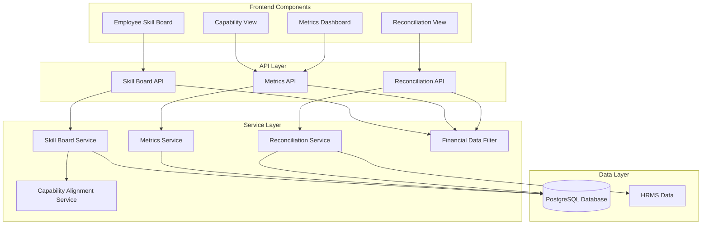
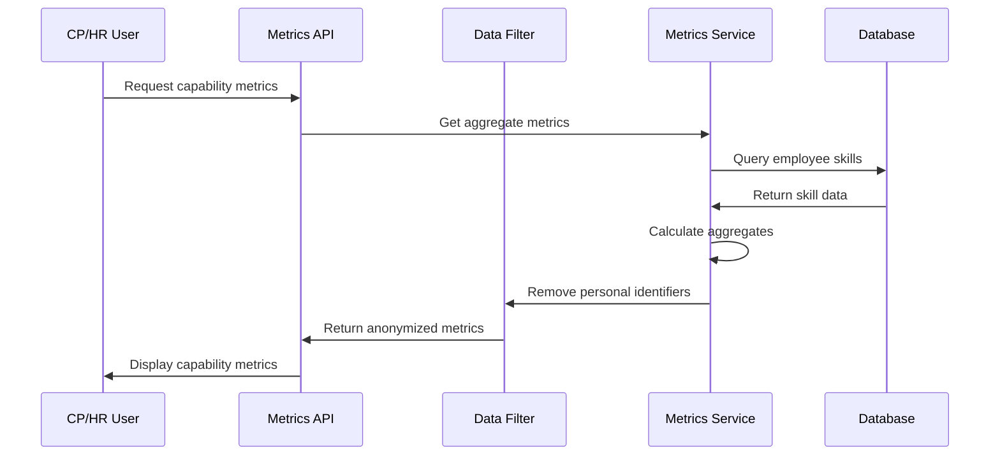

# Skill Board Views & Capability Metrics Design

## Overview

This design implements the Skill Board user interface and capability metrics features that enable different user roles to view skill information, proficiency levels, and aggregate capability metrics. The system explicitly excludes financial data while supporting reconciliation use cases.

The design builds upon the existing FastAPI/SQLAlchemy backend and React frontend, adding new API endpoints, services, and UI components for skill visualization and capability metrics.

## Architecture

### High-Level Architecture



### Data Flow for Capability Metrics



## Components and Interfaces

### 1. Skill Board Service

**Purpose**: Provides employee skill data and capability alignment calculations

**Key Components**:
- `SkillBoardService`: Main service for skill board operations
- `CapabilityAlignmentCalculator`: Calculates skill alignment with capability requirements
- `SkillGapAnalyzer`: Identifies skill gaps for employees

**Interfaces**:
```python
class SkillBoardService:
    def get_employee_skills(self, employee_id: str) -> EmployeeSkillBoard
    def get_capability_alignment(self, employee_id: str) -> CapabilityAlignment
    def get_skill_gaps(self, employee_id: str) -> List[SkillGap]
    def get_proficiency_display(self, rating: str) -> ProficiencyDisplay
```

### 2. Metrics Service

**Purpose**: Calculates and provides aggregate capability metrics

**Key Components**:
- `MetricsService`: Main service for metrics calculations
- `SkillDistributionCalculator`: Calculates skill distributions
- `CoverageAnalyzer`: Analyzes capability coverage
- `TrendCalculator`: Calculates skill trends over time

**Interfaces**:
```python
class MetricsService:
    def get_capability_distribution(self, capability: Optional[str] = None) -> SkillDistribution
    def get_skill_counts_by_proficiency(self, filters: MetricsFilter) -> Dict[str, int]
    def get_capability_coverage(self, capability: str) -> CoverageMetrics
    def get_skill_trends(self, period: str) -> TrendData
    def get_training_needs(self, capability: str) -> List[TrainingNeed]
```

### 3. Financial Data Filter Service

**Purpose**: Ensures all data outputs exclude financial information

**Key Components**:
- `FinancialDataFilter`: Filters out financial fields from data
- `FieldValidator`: Validates that no financial fields are present
- `ExportSanitizer`: Sanitizes data for export

**Interfaces**:
```python
class FinancialDataFilter:
    def filter_response(self, data: Dict) -> Dict
    def validate_no_financial_data(self, data: Dict) -> bool
    def get_excluded_fields(self) -> List[str]
    def sanitize_for_export(self, data: List[Dict]) -> List[Dict]
```

### 4. Reconciliation Service

**Purpose**: Compares skill board assignments with HRMS data

**Key Components**:
- `ReconciliationService`: Main service for reconciliation operations
- `AssignmentComparer`: Compares assignments between systems
- `DiscrepancyDetector`: Identifies mismatches

**Interfaces**:
```python
class ReconciliationService:
    def compare_assignments(self, employee_id: str) -> ReconciliationResult
    def get_all_discrepancies(self) -> List[Discrepancy]
    def generate_reconciliation_report(self, filters: ReconciliationFilter) -> ReconciliationReport
    def export_reconciliation_data(self, format: str) -> bytes
```

## Data Models

### Skill Board Response Models

```python
class EmployeeSkillBoard(BaseModel):
    """Employee skill board data."""
    employee_id: str
    name: str
    home_capability: Optional[str]
    team: Optional[str]
    skills: List[SkillWithProficiency]
    capability_alignment: Optional[CapabilityAlignment]
    skill_gaps: List[SkillGap]

class SkillWithProficiency(BaseModel):
    """Skill with proficiency information."""
    skill_id: int
    skill_name: str
    category: Optional[str]
    rating: str  # Beginner, Developing, Intermediate, Advanced, Expert
    rating_display: ProficiencyDisplay
    years_experience: Optional[float]
    is_required: bool
    meets_requirement: bool

class ProficiencyDisplay(BaseModel):
    """Visual display information for proficiency."""
    level: str
    color: str
    icon: str
    numeric_value: int  # 1-5 for calculations

class CapabilityAlignment(BaseModel):
    """Capability alignment calculation result."""
    capability: str
    alignment_score: float  # 0-100
    required_skills_met: int
    required_skills_total: int
    average_proficiency: float
```

### Metrics Response Models

```python
class SkillDistribution(BaseModel):
    """Aggregate skill distribution."""
    capability: Optional[str]
    total_employees: int
    skill_counts: Dict[str, int]  # skill_name -> count
    proficiency_distribution: Dict[str, Dict[str, int]]  # skill -> proficiency -> count

class CoverageMetrics(BaseModel):
    """Capability coverage metrics."""
    capability: str
    coverage_percentage: float
    skills_with_coverage: int
    skills_without_coverage: int
    critical_gaps: List[str]

class TrendData(BaseModel):
    """Skill trend data over time."""
    period: str
    data_points: List[TrendPoint]
    growth_rate: float

class TrendPoint(BaseModel):
    """Single trend data point."""
    date: str
    skill_count: int
    average_proficiency: float

class TrainingNeed(BaseModel):
    """Training need identification."""
    skill_name: str
    current_coverage: float
    required_coverage: float
    gap_percentage: float
    priority: str  # High, Medium, Low
```

### Reconciliation Models

```python
class ReconciliationResult(BaseModel):
    """Reconciliation comparison result."""
    employee_id: str
    employee_name: str
    skill_board_assignments: List[AssignmentInfo]
    hrms_assignments: List[AssignmentInfo]
    discrepancies: List[Discrepancy]
    match_status: str  # Match, Partial, Mismatch

class AssignmentInfo(BaseModel):
    """Assignment information (no financial data)."""
    project_name: str
    allocation_percentage: float
    is_primary: bool
    start_date: Optional[str]
    end_date: Optional[str]

class Discrepancy(BaseModel):
    """Assignment discrepancy."""
    employee_id: str
    employee_name: str
    discrepancy_type: str  # Missing, Extra, Allocation_Mismatch
    skill_board_value: Optional[str]
    hrms_value: Optional[str]
    field: str
```

## Error Handling

### Data Access Errors

1. **Unauthorized Access**:
   - Insufficient permissions: Return 403 with clear message
   - Role validation failure: Log attempt, redirect to appropriate view

2. **Data Not Found**:
   - Employee not found: Return 404 with helpful message
   - Capability not found: Return 404 with available capabilities

3. **Calculation Errors**:
   - Division by zero in metrics: Return 0 or N/A with explanation
   - Missing required data: Log warning, return partial results

### Financial Data Violations

1. **Field Validation Failures**:
   - Financial field detected: Log violation, remove field, alert admin
   - Export contains financial data: Block export, return error

2. **Schema Violations**:
   - Attempt to add financial field: Reject with clear error message
   - Query includes financial filter: Strip filter, log attempt

## Testing Strategy

### Unit Testing Approach

The system will use pytest for comprehensive unit testing:

- **Skill Board Service**: Test skill retrieval, alignment calculations, gap analysis
- **Metrics Service**: Test aggregation, distribution calculations, trend analysis
- **Financial Filter**: Test field exclusion, validation, sanitization
- **Reconciliation Service**: Test comparison logic, discrepancy detection

### Property-Based Testing Approach

The system will use Hypothesis for property-based testing to verify universal properties. Property-based tests will run a minimum of 100 iterations each.

## Correctness Properties

*A property is a characteristic or behavior that should hold true across all valid executions of a system-essentially, a formal statement about what the system should do. Properties serve as the bridge between human-readable specifications and machine-verifiable correctness guarantees.*

### Property Reflection

After analyzing all acceptance criteria, several properties can be consolidated:

- Financial exclusion properties (3.1, 3.2, 3.3, 4.3, 4.5) can be combined into a comprehensive financial data exclusion property
- Aggregation properties (2.1, 2.2, 5.1, 5.2) can be unified into a metrics aggregation correctness property
- Alignment and gap properties (1.3, 1.4, 2.3, 2.4) can be consolidated into a capability alignment accuracy property

### Core Correctness Properties

**Property 1: Employee Skill Board Completeness**
*For any* employee with assigned skills, the skill board should display all skills with their current proficiency levels and capability alignment information
**Validates: Requirements 1.1, 1.2, 1.5**

**Property 2: Capability Alignment Accuracy**
*For any* employee and capability requirement set, the alignment calculation should correctly identify skills meeting requirements and skills with gaps
**Validates: Requirements 1.3, 1.4**

**Property 3: Metrics Aggregation Correctness**
*For any* set of employees with skills, aggregate metrics should accurately reflect skill counts, distributions, and coverage percentages
**Validates: Requirements 2.1, 2.2, 5.1, 5.3**

**Property 4: Financial Data Exclusion**
*For any* data query, report, or export operation, the result should never contain billing rates, revenue, cost, or other financial information
**Validates: Requirements 3.1, 3.2, 3.3, 3.4, 4.3, 4.5**

**Property 5: Data Anonymization for Aggregate Metrics**
*For any* aggregate metrics request, personal identifiers should be removed while maintaining statistical accuracy
**Validates: Requirements 5.2, 5.4**

**Property 6: Reconciliation Comparison Accuracy**
*For any* comparison between skill board and HRMS assignments, all discrepancies should be correctly identified and categorized
**Validates: Requirements 4.1, 4.2, 4.4**

**Property 7: Proficiency Display Consistency**
*For any* proficiency rating, the display mapping should consistently return the correct visual indicator (color, icon, numeric value)
**Validates: Requirements 1.2**

**Property 8: Metrics Filtering Correctness**
*For any* filter criteria (capability area, team), the filtered metrics should only include data matching the filter
**Validates: Requirements 5.5**

**Property 9: Coverage Percentage Calculation**
*For any* capability area, the coverage percentage should be mathematically correct based on skills present vs skills required
**Validates: Requirements 5.3**

**Property 10: Training Needs Identification**
*For any* capability area with skill gaps, training needs should be correctly identified and prioritized
**Validates: Requirements 2.3, 2.4**

## Implementation Guidelines

### API Design

1. **RESTful Endpoints**:
   - `GET /api/skill-board/{employee_id}` - Employee skill board
   - `GET /api/metrics/capability/{capability}` - Capability metrics
   - `GET /api/metrics/distribution` - Organisation-wide distribution
   - `GET /api/reconciliation/compare/{employee_id}` - Assignment comparison
   - `GET /api/reconciliation/discrepancies` - All discrepancies

2. **Response Filtering**:
   - All responses pass through FinancialDataFilter
   - Aggregate endpoints remove personal identifiers
   - Export endpoints sanitize all data

### Frontend Components

1. **Employee Skill Board**:
   - Skill list with proficiency indicators
   - Capability alignment gauge
   - Skill gap highlights
   - Home capability and team display

2. **Capability View**:
   - Skill distribution charts
   - Coverage metrics
   - Training needs table
   - Filter controls

3. **Metrics Dashboard**:
   - High-level counts
   - Distribution visualizations
   - Trend charts
   - No personal data displayed

4. **Reconciliation View**:
   - Assignment comparison table
   - Discrepancy highlights
   - Export functionality (sanitized)

### Security Considerations

1. **Role-Based Access**:
   - Employees see only their own skill board
   - CPs see their capability area only
   - HR sees organisation-wide data
   - Managers see team-level aggregates

2. **Data Protection**:
   - Financial data never exposed
   - Personal data anonymized in aggregates
   - Access logging for audit trails
